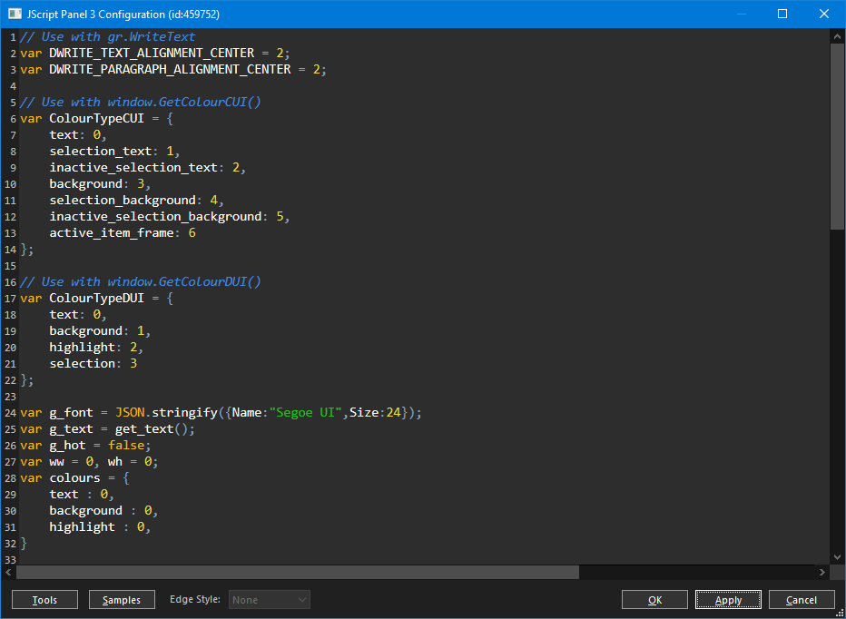
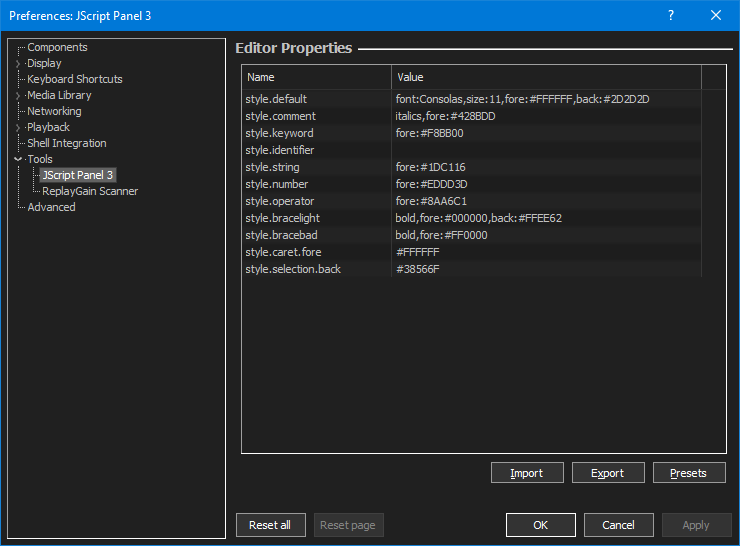

Right click any panel>`Configure` to open the `Configuration Window`.

!!! note
	Some scripts may implement their own menu without a `Configure` option. If
	this happens, you can hold down the ++shift+windows++ keys and then right
	click. This always brings up the default menu.

## Keyboard shortcuts
|||
|---|---|
|++ctrl+'F'++|Open`Find` dialog|
|++ctrl+'G'++|Open `Go To Line` dialog|
|++ctrl+'H'++|Open `Replace` dialog|
|++ctrl+'S'++|Apply|
|++f3++|Find next|
|++shift+f3++|Find previous|

## Main menu

You can use the `File` menu to `Import` and `Export` your scripts. The
`Samples` menu provides quick access to all included scripts and the rest
of the options should be self explanatory!

## Reset

Use this to reset back to the default script.

## Editor Properties

From the main [foobar2000](https://foobar2000.org) `Preferences>Tools>JScript Panel 3`
you can customise the fonts/colours used in the editor above.

`style.caret.fore` and `style.selection.back` accept hex colours only.

For all the others, you can combine any of the following options
separated by a comma.

||
|---|
|font:NAME|
|size:PIXELS|
|bold|
|italics|
|fore:HEX_COLOUR|
|back:HEX_COLOUR|

Hex colours must be the full 6 digits like `#FF0000`.
