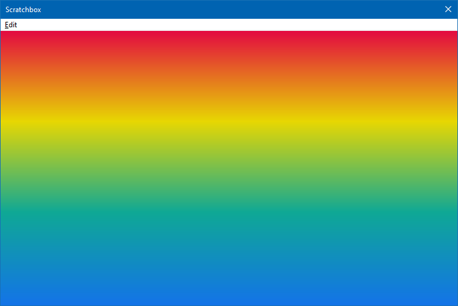
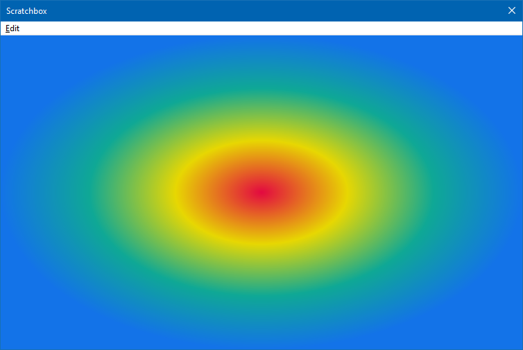

This example covers a few of the more basic ellipse/rounded rectangle methods which are different from previous versions.

!!! example
	```js
	// ==PREPROCESSOR==
	// @name "Rectangle + Ellipse"
	// @author "marc2003"
	// @import "%fb2k_component_path%helpers.txt"
	// ==/PREPROCESSOR==

	var colour = RGB(255, 0, 0);

	function on_paint(gr) {
		gr.DrawRectangle(0, 0, 200, 200, 1, colour);

		// first 2 values are the centre of the shape
		gr.DrawEllipse(100, 100, 50, 50, 1, colour);

		// first 2 values are the centre of the shape
		gr.FillEllipse(500, 100, 50, 50, colour);

		gr.FillRoundedRectangle(0, window.Height - 201, 200, 200, 50, 50, colour);
		gr.DrawRoundedRectangle(window.Width - 200, window.Height - 201, 200, 200, 50, 50, 1, colour);
	}
	```

**Methods**

## `DrawEllipse(centreX, centreY, radiusX, radiusY, line_width, colour)`
|Arguments|||
|---|---|---|
|centreX|`number`|
|centreY|`number`|
|radiusX|`number`|
|radiusY|`number`|
|line_width|`number`|
|colour|`number`|

No return value.

## `DrawImage(image, dstX, dstY, dstW, dstH, srcX, srcY, srcW, srcH[, opacity, angle])`
|Arguments|||
|---|---|---|
|image|[IJSImage](../IJSImage)|
|dstX|`number`|
|dstY|`number`|
|dstW|`number`|
|dstH|`number`|
|srcX|`number`|
|srcY|`number`|
|srcW|`number`|
|srcH|`number`|
|opacity|`number`|Floating point number between `0` and `1`. Default `1`.|
|angle|`number`|Default `0`.|

No return value.

!!! note
	This differs from previous versions where `alpha` has been replaced
	with `opacity`. Also, `angle` is now the last argument.

## `DrawImageWithMask(image, mask_image, x, y, w, h)`
|Arguments|||
|---|---|---|
|image|[IJSImage](../IJSImage)|
|mask_image|[IJSImage](../IJSImage)|
|x|`number`|
|y|`number`|
|w|`number`|
|h|`number`|

!!! example
	Because this method does not support src co-ords,
	this sample makes the original image square first which is more
	suitable for a circular mask. Also included is a text mask example.

	Unlike the previous `ApplyMask`, there should be no white background.
	Just draw black for where you want to keep.

	Mask images don't have to have the same width/height.

	```js

	// ==PREPROCESSOR==
	// @name "DrawImageWithMask"
	// @author "marc2003"
	// @import "%fb2k_component_path%helpers.txt"
	// ==/PREPROCESSOR==

	var temp_gr;

	var circular_mask = utils.CreateImage(512, 512);
	temp_gr = circular_mask.GetGraphics();
	temp_gr.FillEllipse(256, 256, 256, 256, RGB(0, 0, 0));
	circular_mask.ReleaseGraphics();
	temp_gr = null;

	var text_mask = utils.CreateImage(512, 512);
	temp_gr = text_mask.GetGraphics();
	temp_gr.DrawRectangle(0, 0, 512, 512, 10, RGB(0, 0, 0));
	temp_gr.WriteText("MASK", JSON.stringify({Size:160,Weight:900}), RGB(0, 0, 0), 0, 0, 512, 512, 2, 2);
	text_mask.ReleaseGraphics();
	temp_gr = null;

	var img = utils.LoadImage(fb.ComponentPath + 'samples\\images\\1.webp');
	var square = make_square(img, 300);

	function make_square(img, size) {
		if (!img) return null;

		if (img.Width < img.Height) {
			var src_x = 0;
			var src_w = img.Width;
			var src_h = img.Width;
			var src_y = Math.round((img.Height - src_h) / 4);
		} else {
			var src_y = 0;
			var src_w = img.Height;
			var src_h = img.Height;
			var src_x = Math.round((img.Width - src_w) / 2);
		}

		var square = utils.CreateImage(size, size);
		var temp_gr = square.GetGraphics();
		temp_gr.DrawImage(img, 0, 0, size, size, src_x, src_y, src_w, src_h);
		square.ReleaseGraphics();
		return square;
	}

	function on_paint(gr) {
		gr.FillRectangle(0, 0, window.Width, window.Height, RGB(255, 0, 0));
		// original image as-is
		gr.DrawImage(img, 0, 0, img.Width, img.Height, 0, 0, img.Width, img.Height);
		// squared image, no mask
		gr.DrawImage(square, 0, img.Height, square.Width, square.Height, 0, 0, square.Width, square.Height)
		// squared image, circular mask
		gr.DrawImageWithMask(square, circular_mask, 300, img.Height, square.Width, square.Height);
		// squared image, text mask
		gr.DrawImageWithMask(square, text_mask, 600, img.Height, square.Width, square.Height);
	}
	```

## `DrawLine(x1, y1, x2, y2, line_width, colour)`
|Arguments|||
|---|---|---|
|x1|`number`|
|y1|`number`|
|x2|`number`|
|y2|`number`|
|line_width|`number`|
|colour|`number`|

No return value.

## `DrawRectangle(x, y, w, h, line_width, colour)`
|Arguments|||
|---|---|---|
|x|`number`|
|y|`number`|
|w|`number`|
|h|`number`|
|line_width|`number`|
|colour|`number`|

No return value.

## `DrawRoundedRectangle(x, y, w, h, radiusX, radiusY, line_width, colour)`
|Arguments|||
|---|---|---|
|x|`number`|
|y|`number`|
|w|`number`|
|h|`number`|
|radiusX|`number`|
|radiusY|`number`|
|line_width|`number`|
|colour|`number`|

No return value.

## `gr.FillEllipse(centreX, centreY, radiusX, radiusY, colour)`
|Arguments|||
|---|---|---|
|centreX|`number`|
|centreY|`number`|
|radiusX|`number`|
|radiusY|`number`|
|colour|`number`|

No return value.

## `FillGradientRectangle(x, y, w, h, direction, colour1, colour2)`
|Arguments|||
|---|---|---|
|x|`number`|
|y|`number`|
|w|`number`|
|h|`number`|
|direction|`number`|`0` vertical, `1` horizontal|
|colour1|`number`|
|colour2|`number`|

No return value.

## `FillGradientRectangleAdvanced(x, y, w, h, str)`
|Arguments|||
|---|---|---|
|x|`number`|
|y|`number`|
|w|`number`|
|h|`number`|
|str|`string`|A `brush` object that needs to be stringifed. See examples below.|

No return value.

This allows you to create `D2D` [Linear](https://docs.microsoft.com/en-us/windows/win32/direct2d/direct2d-brushes-overview#using-linear-gradient-brushes) and [Radial](https://docs.microsoft.com/en-us/windows/win32/direct2d/direct2d-brushes-overview#using-radial-gradient-brushes) brushes.

!!! example

	=== "Linear Brush"
		

		```js
		// ==PREPROCESSOR==
		// @name "FillGradientRectangleAdvanced (Linear)"
		// @author "marc2003"
		// @import "%fb2k_component_path%helpers.txt"
		// ==/PREPROCESSOR==

		var brush = {
			start : [0, 0], // x and y values
			end : [0, 0], // x and y values
			stops: [
				[ 0.0, RGB(227, 9, 64, 1) ],
				[ 0.33, RGB(231, 215, 2) ],
				[ 0.66, RGB(15, 168, 149) ],
				[ 1.0, RGB(19, 115, 232) ]
			]
		};

		function on_paint(gr) {
			// Vertical effect
			brush.end = [0, window.Height];

			// If you wanted a horizontal effect, you'd use
			// brush.end = [window.Width, 0]

			var str = JSON.stringify(brush);
			gr.FillGradientRectangleAdvanced(0, 0, window.Width, window.Height, str);
		}
		```

	=== "Radial Brush"
		

		```js
		// ==PREPROCESSOR==
		// @name "FillGradientRectangleAdvanced (Radial)"
		// @author "marc2003"
		// @import "%fb2k_component_path%helpers.txt"
		// ==/PREPROCESSOR==

		var brush = {
			centre : [0, 0], // x and y values
			radius : [0, 0], // x and y values
			stops: [
				[ 0.0, RGB(227, 9, 64, 1) ],
				[ 0.33, RGB(231, 215, 2) ],
				[ 0.66, RGB(15, 168, 149) ],
				[ 1.0, RGB(19, 115, 232) ]
			]
		};

		function on_paint(gr) {
			brush.centre = [window.Width / 2, window.Height / 2];
			brush.radius = [window.Width / 2, window.Height / 2];
			var str = JSON.stringify(brush);
			gr.FillGradientRectangleAdvanced(0, 0, window.Width, window.Height, str);
		}
		```

## `FillRectangle(x, y, w, h, colour)`
|Arguments|||
|---|---|---|
|x|`number`|
|y|`number`|
|w|`number`|
|h|`number`|
|colour|`number`|

No return value.

## `FillRoundedRectangle(x, y, w, h, radiusX, radiusY, colour)`
|Arguments|||
|---|---|---|
|x|`number`|
|y|`number`|
|w|`number`|
|h|`number`|
|radiusX|`number`|
|radiusY|`number`|
|colour|`number`|

No return value.

## `WriteText(text, font, colour, x, y, w, h[, text_alignment, paragraph_alignment, word_wrapping])`
|Arguments|||
|---|---|---|
|text|`string`||
|font|`string`||
|colour|`number`||
|x|`number`|
|y|`number`|
|w|`number`|
|h|`number`|
|text_aligment|[DWRITE_TEXT_ALIGNMENT](../../flags/#dwrite_text_alignment)|Default `0`.|
|paragraph_aligment|[DWRITE_PARAGRAPH_ALIGNMENT](../../flags/#dwrite_paragraph_alignment)|Default `0`.|
|word_wrapping|[DWRITE_WORD_WRAPPING](../../flags/#dwrite_word_wrapping)|Default `0`.|

No return value.

The font must be in string from and this can come directly from using [window.GetFontCUI](../../namespaces/window/#windowgetfontcuitype) / [window.GetFontDUI](../../namespaces/window/#windowgetfontduitype).

If you prefer, you can create your own from scratch.

!!! example
	```js
	var obj = {
		Name : "Segoe UI",
		Size : 16,
		Weight : 400,
		Style : 0,
		Stretch : 5,
	}

	var font = JSON.stringify(obj);
	```

See [Flags](../../flags) for all available options. None are mandatory. You can even supply an empty string and defaults of `Segoe UI` and a font size of `16px` will be used.

It's also possible to style ranges of text with different fonts/properties/colours using an array.

!!! example
	```js
	// ==PREPROCESSOR==
	// @name "WriteTextStyles"
	// @author "marc2003"
	// @import "%fb2k_component_path%helpers.txt"
	// ==/PREPROCESSOR==

	/*
	This sample splits a string in to whole words and then randomly
	styles each one and updates itself twice a second. Every element
	of the array which is used for styling must have a valid
	start/length value. You can see how the start value is
	incremented for each word.
	*/

	var fonts = utils.ListFonts().toArray();
	var text = 'Lorem ipsum dolor sit amet, consectetur adipiscing elit, sed do eiusmod tempor incididunt ut labore et dolore magna aliqua. Ut enim ad minim veniam, quis nostrud exercitation ullamco laboris nisi ut aliquip ex ea commodo consequat. Duis aute irure dolor in reprehenderit in voluptate velit esse cillum dolore eu fugiat nulla pariatur. Excepteur sint occaecat cupidatat non proident, sunt in culpa qui officia deserunt mollit anim id est laborum.';

	// split text in to whole words for styling
	var arr = text.split(' ');
	var styles = [];

	refresh();

	window.SetInterval(function () {
		refresh();
		window.Repaint();
	}, 500);

	function refresh() {
		styles = [];
		var start = 0;
		arr.forEach(function(item, i) {
			styles.push({
				// when using an array of styles, Start and Length are mandatory
				Start : start,
				Length : item.length + 1,
				// the following are all optional and may be omitted. Segoe UI/16px will be used if Name/Size are not specified.
				Name : fonts[Math.floor(Math.random() * fonts.length)],
				Size : 12 + Math.floor(Math.random() * 20),
				Weight : Math.round(Math.random() * 800) + 100, // values between 100-900
				Underline : Math.random() < 0.1,
				Strikethrough : Math.random() < 0.1,
				Colour : RGB(Math.random() * 200, Math.random() * 200, Math.random() * 200),
			});
			start += item.length + 1;
		});
	}

	function on_paint(gr) {
		gr.WriteText(text, JSON.stringify(styles), 0, 10, 10, window.Width - 20, window.Height - 20);
	}
	```

## `WriteTextLayout(text_layout, colour, x, y, w, h, vertical_offset)`
|Arguments|||
|---|---|---|
|text_layout|[ITextLayout](../../interfaces/ITextLayout)|
|colour|`number`|
|x|`number`|
|y|`number`|
|w|`number`|
|h|`number`|
|vertical_offset|`number`|Default `0`.|

See [utils.CreateTextLayout](../../namespaces/utils/#utilscreatetextlayouttext-font_name-font_size-font_size-font_style-font_stretch-text_aligment-paragraph_aligment-word_wrapping) for an example.
