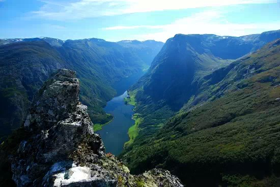
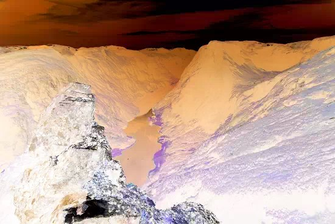

**Properties**

|||||
|---|---|---|---|
|Height|`number`|read|
|Path|`string`|read|This will the source path of the image when created from the various album art methods and [utils.LoadImage](../../namespaces/utils/#utilsloadimagepath). Will be empty if image is cloned or created with [utils.CreateImage](../../namespaces/utils/#utilscreateimagewidth-height) or [utils.LoadSVG](../../namespaces/utils/#utilsloadsvgpath_or_xml-max_width).|
|Width|`number`|read|

**Methods**

## `ApplyEffect(effect)`
|Arguments|||
|---|---|---|
|effect|[ImageEffect](../../flags/#imageeffect)|

No return value.

!!! note
	This method requires `Windows 10` or later. If used on earlier
	versions, a script error will be thrown.
	
!!! example
	```js
	var original = utils.LoadImage(fb.ComponentPath + 'samples\\images\\1.webp');

	var grayscale = original.Clone();
	var invert = original.Clone();
	var sepia = original.Clone();

	grayscale.ApplyEffect(0);
	invert.ApplyEffect(1);
	sepia.ApplyEffect(2);

	function on_mouse_lbtn_dblclk() {
		original.SaveAs("z:\\original.jpg");
		grayscale.SaveAs("z:\\grayscale.jpg");
		invert.SaveAs("z:\\invert.jpg");
		sepia.SaveAs("z:\\sepia.jpg");
	}
	```

	=== "Original"
		

	=== "Grayscale"
		

	=== "Invert"
		

	=== "Sepia"
		

## `Clone()`
Returns an `IJSImage` instance.

## `Dispose()`
No return value.

## `FlipRotate(options)`
|Arguments|||
|---|---|---|
|options|[WICBitmapTransform](../../flags/#wicbitmaptransform)|

No return value.

## `GetColourScheme(count)`
|Arguments|||
|---|---|---|
|count|`number`|

Returns a `VBArray` so you need to use `.toArray()` on the result.

!!! example
	```js
	// Tracks playlist selection

	var img = null;
	var arr = [];
	on_item_focus_change();

	function on_item_focus_change() {
		if (img) {
			img.Dispose();
			img = null;
		}

		arr = [];
		var metadb = fb.GetFocusItem();
		if (metadb) {
			img = metadb.GetAlbumArt();

			if (img) {
				arr = img.GetColourScheme(10).toArray();
			}
		}
		window.Repaint();
	}

	function on_paint(gr) {
		if (img && arr.length) {
			gr.DrawImage(img, 0, 0, 300, 300, 0, 0, img.Width, img.Height);
			for (var i = 0; i < arr.length; i++) {
				gr.FillRectangle(300, i * 30, window.Width - 300, 30, arr[i]);
			}
		}
	}

	function on_playlist_switch() {
		on_item_focus_change();
	}
	```

## `GetGraphics()`
Return an [IJSGraphics](../IJSGraphics) instance.

## `ReleaseGraphics()`
No return value.

## `Resize(width, height)`
|Arguments|||
|---|---|---|
|width|`number`|
|height|`number`|

No return value.

## `SaveAs(path)`
|Arguments|||
|---|---|---|
|path|`string`|The parent folder must already exist. The image is saved as `JPG` so you should use that as the file extension.|

Returns a `boolean` value to indicate success.

## `StackBlur(radius)`
|Arguments|||
|---|---|---|
|radius|`number`|Valid values `2`-`254`.|

No return value.

!!! example
	```js
	// ==PREPROCESSOR==
	// @name "StackBlur (image)"
	// @author "marc2003"
	// @import "%fb2k_component_path%helpers.txt"
	// ==/PREPROCESSOR==

	var img = utils.LoadImage(fb.ComponentPath + 'samples\\images\\1.webp');
	var blur_img = null;
	var radius = 20;

	StackBlur(radius);

	function StackBlur(radius) {
		if (blur_img) blur_img.Dispose();
		blur_img = img.Clone();
		blur_img.StackBlur(radius);
	}

	function on_paint(gr) {
		gr.DrawImage(img, 0, 0, 550, 368, 0, 0, 550, 368);
		gr.DrawImage(blur_img, 0, 368, 550, 368, 0, 0, 550, 368);
		gr.FillRectangle(0, 0, window.Width, 24, RGB(0, 0, 0));
		gr.WriteText('Scroll mouse to change radius: ' + radius, '', RGB(255, 255, 255), 0, 0, window.Width, 24, 2, 0);
	}

	function on_mouse_wheel(step) {
		radius += step * 5;
		if (radius < 2)
			radius = 2;
		if (radius > 254)
			radius = 254;
		StackBlur(radius);
		window.Repaint();
	}
	```
